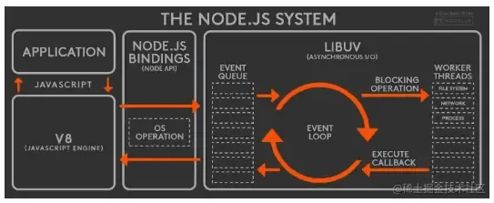
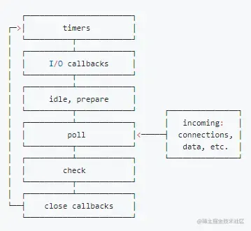
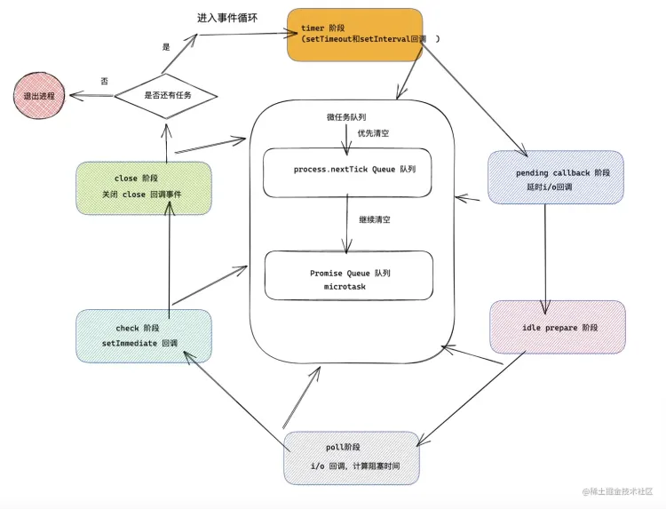
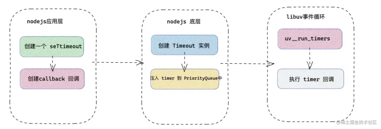
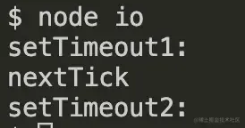
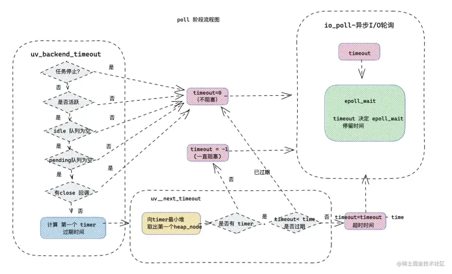
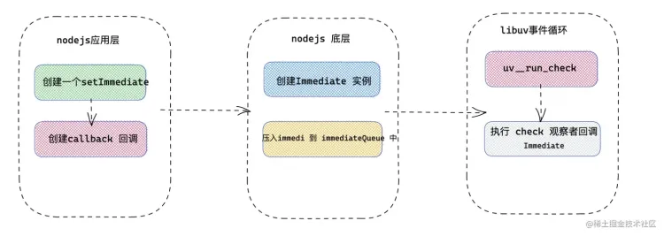
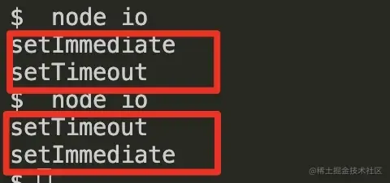
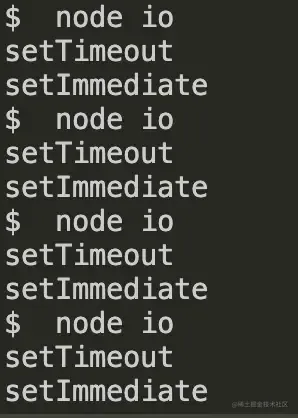

## 一、Node 中的 Event Loop
### 1、Node简介
Node 中的 Event Loop 和浏览器中的是完全不相同的东西。Node.js采用V8作为js的解析引擎，而I/O处理方面使用了libuv，libuv是一个基于事件驱动的跨平台抽象层，封装了不同操作系统一些底层特性，对外提供统一的API，事件循环机制也是它里面的实现（下文会详细介绍）。

 Node.js的运行机制如下:

- V8引擎解析JavaScript脚本。
- 解析后的代码，调用Node API。
- libuv库负责Node API的执行。它将不同的任务分配给不同的线程，形成一个Event Loop（事件循环），以异步的方式将任务的执行结果返回给V8引擎。
- V8引擎再将结果返回给用户。
### 2、事件循环阶段
其中libuv引擎中的事件循环分为 6 个阶段，它们会按照顺序反复运行。每当进入某一个阶段的时候，都会从对应的回调队列中取出函数去执行。当队列为空或者执行的回调函数数量到达系统设定的阈值，就会进入下一阶段。


- 第一阶段： **timer** ，timer 阶段主要做的事是，执行 setTimeout 或 setInterval 注册的回调函数。
- 第二阶段：**pending callback** ，大部分 I/O 回调任务都是在 poll 阶段执行的，但是也会存在一些上一次事件循环遗留的被延时的 I/O 回调函数，那么此阶段就是为了调用之前事件循环延迟执行的 I/O 回调函数。
- 第三阶段：**idle prepare** 阶段，仅用于 nodejs 内部模块的使用。
- 第四阶段：**poll** 轮询阶段，这个阶段主要做两件事，一这个阶段会执行异步 I/O 的回调函数； 二 计算当前轮询阶段阻塞后续阶段的时间。
- 第五阶段：**check阶段**，当 poll 阶段回调函数队列为空的时候，开始进入 check 阶段，主要执行 setImmediate 回调函数。
- 第六阶段：**close阶段**，执行注册 close 事件的回调函数。
```cpp
int uv_run(uv_loop_t* loop, uv_run_mode mode) {
    // 省去之前的流程。
    while (r != 0 && loop->stop_flag == 0) {

        /* 更新事件循环的时间 */ 
        uv__update_time(loop);

        /*第一阶段： timer 阶段执行  */
        uv__run_timers(loop);

        /*第二阶段： pending 阶段 */
        ran_pending = uv__run_pending(loop);

        /*第三阶段： idle prepare 阶段 */
        uv__run_idle(loop);
        uv__run_prepare(loop);

        timeout = 0;
        if ((mode == UV_RUN_ONCE && !ran_pending) || mode == UV_RUN_DEFAULT)
            /* 计算 timeout 时间  */
            timeout = uv_backend_timeout(loop);

        /* 第四阶段：poll 阶段 */
        uv__io_poll(loop, timeout);

        /* 第五阶段：check 阶段 */
        uv__run_check(loop);
        /* 第六阶段： close 阶段  */
        uv__run_closing_handles(loop);
        /* 判断当前线程还有任务 */ 
        r = uv__loop_alive(loop);

        /* 省去之后的流程 */
    }
    return r;
}
```
### 3、 任务队列
在整个事件循环过程中，有四个队列是在 libuv 的事件循环中进行的，还有两个队列是在 nodejs 中执行的分别是 **promise 队列** 和 **nextTick** 队列。
在 NodeJS 中不止一个队列，不同类型的事件在它们自己的队列中入队。在处理完一个阶段后，移向下一个阶段之前，事件循环将会处理两个中间队列，直到两个中间队列为空。
#### libuv 处理任务队列
事件循环的每一个阶段，都会执行对应任务队列里面的内容。

- timer 队列（ **PriorityQueue** ）：本质上的数据结构是**二叉最小堆**，二叉最小堆的根节点获取最近的时间线上的 timer 对应的回调函数。
- I/O 事件队列：存放 I/O 任务。
- Immediate 队列（ **ImmediateList** ）：多个 Immediate ，node 层用链表数据结构储存。
- 关闭回调事件队列：放置待 close 的回调函数。
#### 非 libuv 中间队列

- **nextTick** 队列 ： 存放 nextTick 的回调函数。这个是在 nodejs 中特有的。
- **Microtasks** 微队列 Promise ： 存放 promise 的回调函数。

中间队列的执行特点：

- 首先要明白两个中间队列并非在 libuv 中被执行，它们都是在 nodejs 层执行的，在 libuv 层处理每一个阶段的任务之后，会和 node 层进行通讯，那么会优先处理两个队列中的任务。
- nextTick 任务的优先级要大于 Microtasks 任务中的 Promise 回调。也就是说 node 会首先清空 nextTick 中的任务，然后才是 Promise 中的任务。为了验证这个结论，例举一个打印结果的题目如下：
```javascript
/* TODO: 打印顺序  */
setTimeout(()=>{
    console.log('setTimeout 执行')
},0)

const p = new Promise((resolve)=>{
     console.log('Promise执行')
     resolve()
})
p.then(()=>{
    console.log('Promise 回调执行')
})

process.nextTick(()=>{
    console.log('nextTick 执行')
})
console.log('代码执行完毕')

```
打印结果：Promise执行 -> 代码执行完毕 -> nextTick 执行 -> Promise 回调执行 -> setTimeout 执行
解释：很好理解为什么这么打印，在主代码事件循环中，** Promise执行** 和 **代码执行完毕** 最先被打印，nextTick 被放入 nextTick 队列中，Promise 回调放入 Microtasks 队列中，setTimeout 被放入 timer 堆中。接下来主循环完成，开始清空两个队列中的内容，首先清空 nextTick 队列，nextTick 执行 被打印，接下来清空 Microtasks 队列，Promise 回调执行 被打印，最后再判断事件循环 loop 中还有 timer 任务，那么开启新的事件循环 ，首先执行，timer 任务，setTimeout 执行被打印。 整个流程完毕。

- 无论是 nextTick 的任务，还是 promise 中的任务， **两个任务中的代码会阻塞事件循环的有序进行**，导致 I/O 饿死的情况发生，所以需要谨慎处理两个任务中的逻辑。比如如下：
```javascript
/* TODO: 阻塞 I/O 情况 */
process.nextTick(()=>{
    const now = +new Date()
    /* 阻塞代码三秒钟 */
    while( +new Date() < now + 3000 ){}
})

fs.readFile('./file.js',()=>{
    console.log('I/O: file ')
})

setTimeout(() => {
    console.log('setTimeout: ')
}, 0);

```

- 三秒钟， 事件循环中的 timer 任务和 I/O 任务，才被有序执行。也就是说 nextTick 中的代码，阻塞了事件循环的有序进行。

### 4、 事件循环流程图
接下来用流程图，表示事件循环的六大阶段的执行顺序，以及两个优先队列的执行逻辑。

接下去我们详细介绍timer、poll、check这3个阶段，因为日常开发中的绝大部分异步任务都是在这3个阶段处理的。

### 5、 timer、poll、check详细介绍
#### timer阶段
##### timer 阶段 -> 计时器 timer / 延时器 interval
**延时器计时器观察者（Expired timers and intervals）**：延时器计时器观察者用来检查通过 setTimeout 或 setInterval创建的异步任务，内部原理和异步 I/O 相似，不过计时器/延时器内部实现没有用线程池。通过setTimeout 或 setInterval定时器对象会被插入到延时器计时器观察者内部的二叉最小堆中，每次事件循环过程中，会从二叉最小堆顶部取出计时器对象，判断 timer/interval 是否过期，如果有，然后调用它，出队。再检查当前队列的第一个，直到没有过期的，移到下一个阶段。
##### libuv 层如何处理 timer
首先一起看一下 libuv 层是如何处理的 timer
> libuv/src/timer.c

```cpp
void uv__run_timers(uv_loop_t* loop) {
  struct heap_node* heap_node;
  uv_timer_t* handle;

  for (;;) {
    /* 找到 loop 中 timer_heap 中的根节点 （ 值最小 ） */  
    heap_node = heap_min((struct heap*) &loop->timer_heap);
    /*  */
    if (heap_node == NULL)
      break;

    handle = container_of(heap_node, uv_timer_t, heap_node);
    if (handle->timeout > loop->time)
      /*  执行时间大于事件循环事件，那么不需要在此次 loop 中执行  */
      break;

    uv_timer_stop(handle);
    uv_timer_again(handle);
    handle->timer_cb(handle);
  }
}

```

- 如上 handle timeout 可以理解成过期时间，也就是计时器回到函数的执行时间。
- 当 timeout 大于当前事件循环的开始时间时，即表示还没有到执行时机，回调函数还不应该被执行。那么根据二叉最小堆的性质，父节点始终比子节点小，那么根节点的时间节点都不满足执行时机的话，其他的 timer 也不满足执行时间。此时，退出 timer 阶段的回调函数执行，直接进入事件循环下一阶段。
- 当过期时间小于当前事件循环 tick 的开始时间时，表示至少存在一个过期的计时器，那么循环迭代计时器最小堆的根节点，并调用该计时器所对应的回调函数。每次循环迭代时都会更新最小堆的根节点为最近时间节点的计时器。

如上是 timer 阶段在 libuv 中执行特点。接下里分析一下 node 中是如何处理定时器延时器的。
##### node 层如何处理 timer
在 Nodejs 中 setTimeout 和 setInterval 是 nodejs 自己实现的，来一起看一下实现细节：
> node/lib/timers.js

```javascript
function setTimeout(callback，after){
  //...
  /* 判断参数逻辑 */
  //..
  /* 创建一个 timer 观察者 */
  const timeout = new Timeout(callback, after, args, false, true);
  /* 将 timer 观察者插入到 timer 堆中  */
  insert(timeout, timeout._idleTimeout);

  return timeout;
}

```

- setTimeout： 逻辑很简单，就是创建一个 timer 时间观察者，然后放入计时器堆中。

那么 Timeout 做了些什么呢？
> node/lib/internal/timers.js

```javascript
function Timeout(callback, after, args, isRepeat, isRefed) {
  after *= 1 
  if (!(after >= 1 && after <= 2 ** 31 - 1)) {
    after = 1 // 如果延时器 timeout 为 0 ，或者是大于 2 ** 31 - 1 ，那么设置成 1 
  }
  this._idleTimeout = after; // 延时时间 
  this._idlePrev = this;
  this._idleNext = this;
  this._idleStart = null;
  this._onTimeout = null;
  this._onTimeout = callback; // 回调函数
  this._timerArgs = args;
  this._repeat = isRepeat ? after : null;
  this._destroyed = false;  

  initAsyncResource(this, 'Timeout');
}

```

- 在 nodejs 中无论 setTimeout 还是 setInterval 本质上都是 Timeout 类。超出最大时间阀 2 ** 31 - 1 或者 setTimeout(callback, 0) ，_idleTimeout 会被设置成 1 ，转换为 setTimeout(callback, 1) 来执行。
##### timer 处理流程图
用一副流程图描述一下，我们创建一个 timer ，再到 timer 在事件循环里面执行的流程。

##### timer 特性
这里有两点需要注意：

- **执行机制** ：延时器计时器观察者，每一次都会执行一个，执行一个之后会清空 nextTick 和 Promise， 过期时间是决定两者是否执行的重要因素，还有一点 poll 会计算阻塞 timer 执行的时间，对 timer 阶段任务的执行也有很重要的影响。

验证结论一次执行一个 timer 任务 ，先来看一段代码片段：
```javascript
setTimeout(()=>{
    console.log('setTimeout1:')
    process.nextTick(()=>{
        console.log('nextTick')
    })
},0)
setTimeout(()=>{
    console.log('setTimeout2:')
},0)

```
打印结果：

nextTick 队列是在事件循环的每一阶段结束执行的，两个延时器的阀值都是 0 ，如果在 timer 阶段一次性执行完，过期任务的话，那么打印 setTimeout1 -> setTimeout2 -> nextTick ，实际上先执行一个 timer 任务，然后执行 nextTick 任务，最后再执行下一个 timer 任务。

- **精度问题** ：关于 setTimeout 的计数器问题，计时器并非精确的，尽管在 nodejs 的事件循环非常的快，但是从延时器 timeout 类的创建，会占用一些事件，再到上下文执行， I/O 的执行，nextTick 队列执行，Microtasks 执行，都会阻塞延时器的执行。甚至在检查 timer 过期的时候，也会消耗一些 cpu 时间。
- **性能问题** ：如果想用 setTimeout(fn,0) 来执行一些非立即调用的任务，那么性能上不如 process.nextTick 实在，首先 setTimeout 精度不够，还有一点就是里面有定时器对象，并需要在 libuv 底层执行，占用一定性能，所以可以用 process.nextTick 解决这种场景。
#### poll I / O 轮询阶段
在正式讲解 poll 阶段做哪些事情之前，首先看一下，在 libuv 中，轮询阶段的执行逻辑：
```cpp
  timeout = 0;
    if ((mode == UV_RUN_ONCE && !ran_pending) || mode == UV_RUN_DEFAULT)
      /* 计算 timeout   */
      timeout = uv_backend_timeout(loop);
      /* 进入 I/O 轮询 */
      uv__io_poll(loop, timeout);

```

- 初始化超时时间 timeout = 0 ，通过 uv_backend_timeout 计算本次 poll 阶段的超时时间。超时时间会影响到异步 I/O 和后续事件循环的执行。

**timeout代表什么**
首先要明白不同 timeout ，在 I/O 轮询中代表什么意思。

- 当 timeout = 0 的时候，说明 poll 阶段不会阻塞事件循环的进行，那么说明有更迫切执行的任务。那么当前的 poll 阶段不会发生阻塞，会尽快进入下一阶段，尽快结束当前 tick，进入下一次事件循环，那么这些**紧急**任务将被执行。
- 当 timeout = -1时，说明会一直阻塞事件循环，那么此时就可以停留在异步 I/O 的 poll 阶段，等待新的 I/O 任务完成。
- 当 timeout等于常数的情况，说明此时 io poll 循环阶段能够停留的时间，那么什么时候会存在 timeout 为常数呢，将马上揭晓。

**获取timeout**
timeout 的获取是通过 uv_backend_timeout 那么如何获得的呢？
```javascript
int uv_backend_timeout(const uv_loop_t* loop) {
    /* 当前事件循环任务停止 ，不阻塞 */
  if (loop->stop_flag != 0)
    return 0;
   /* 当前事件循环 loop 不活跃的时候 ，不阻塞 */
  if (!uv__has_active_handles(loop) && !uv__has_active_reqs(loop))
    return 0;
  /* 当 idle 句柄队列不为空时，返回 0，即不阻塞。 */
  if (!QUEUE_EMPTY(&loop->idle_handles))
    return 0;
   /* i/o pending 队列不为空的时候。 */  
  if (!QUEUE_EMPTY(&loop->pending_queue))
    return 0;
   /* 有关闭回调 */
  if (loop->closing_handles)
    return 0;
  /* 计算有没有延时最小的延时器 ｜ 定时器 */
  return uv__next_timeout(loop);
}

```
uv_backend_timeout 主要做的事情是：

- 当前事件循环停止时，不阻塞。
- 当前事件循环 loop 不活跃的时候 ，不阻塞。
- 当 idle 队列 （ setImmediate ） 不为空时，返回 0，不阻塞。
- i/o pending 队列不为空的时候，不阻塞。
- 有关闭回调函数的时候，不阻塞。
- 如果上述均不满足，那么通过 uv__next_timeout 计算有没有延时阀值最小的定时器 ｜ 延时器（ 最急迫执行 ），返回延时时间。

接下来看一下 uv__next_timeout 逻辑。
```cpp
int uv__next_timeout(const uv_loop_t* loop) {
    const struct heap_node* heap_node;
    const uv_timer_t* handle;
    uint64_t diff;
    /* 找到延时时间最小的 timer  */
    heap_node = heap_min((const struct heap*) &loop->timer_heap);
    if (heap_node == NULL) /* 如何没有 timer，那么返回 -1 ，一直进入 poll 状态  */
        return -1; 

    handle = container_of(heap_node, uv_timer_t, heap_node);
    /* 有过期的 timer 任务，那么返回 0，poll 阶段不阻塞 */
    if (handle->timeout <= loop->time)
        return 0;
    /* 返回当前最小阀值的 timer 与 当前事件循环的事件相减，得出来的时间，可以证明 poll 可以停留多长时间 */ 
    diff = handle->timeout - loop->time;
    return (int) diff;
}

```

uv__next_timeout 做的事情如下：

- 找到时间阀值最小的 timer （最优先执行的），如何没有 timer，那么返回 -1 。poll 阶段将**无限制阻塞**。这样的好处是一旦有 I/O 执行完毕 ，I/O 回调函数会直接加入到 poll ，接下来就会执行对应的回调函数。
- 如果有 timer ，但是 timeout <= loop.time 证明已经过期了，那么返回 0，poll 阶段不阻塞，优先执行过期任务。
- 如果没有过期，返回当前最小阀值的 timer 与 当前事件循环的事件相减得值，即是可以证明 poll 可以停留多长时间。当停留完毕，证明有过期 timer ，那么进入到下一个 tick。

**执行io_poll**
接下来就是 uv__io_poll 真正的执行，里面有一个 epoll_wait 方法，根据 timeout ，来轮询有没有 I/O 完成，有得话那么执行 I/O 回调。这也是 unix 下异步I/O 实现的重要环节。
**poll阶段本质**
接下来总结一下 poll 阶段的本质：

- poll 阶段就是通过 timeout 来判断，是否阻塞事件循环。poll 也是一种轮询，轮询的是 i/o 任务，事件循环倾向于 poll 阶段的持续进行，其目的就是更快的执行 I/O 任务。如果没有其他任务，那么将一直处于 poll 阶段。
- 如果有其他阶段更紧急待执行的任务，比如 timer ，close ，那么 poll 阶段将不阻塞，会进行下一个 tick 阶段。

**poll 阶段流程图**
我把整个 poll 阶段做的事用流程图表示，省去了一些细枝末节。


#### check 阶段
如果 poll 阶段进入 idle 状态并且 setImmediate 函数存在回调函数时，那么 poll 阶段将打破无限制的等待状态，并进入 check 阶段执行 check 阶段的回调函数。
**check 做的事就是处理 setImmediate 回调。**，先来看一下 Nodejs 中是怎么定义的 setImmediate。
##### Nodejs 底层中的 setImmediate
**setImmediate定义**
> node/lib/timer.js

```javascript
function setImmediate(callback, arg1, arg2, arg3) {
  validateCallback(callback); /* 校验一下回调函数 */
   /* 创建一个 Immediate 类   */
   return new Immediate(callback, args);
}

```

- 当调用 setImmediate 本质上调用 nodejs 中的 setImmediate 方法，首先校验回调函数，然后创建一个 Immediate 类。接下来看一下 Immediate 类。
> node/lib/internal/timers.js

```javascript
class Immediate{
   constructor(callback, args) {
    this._idleNext = null;
    this._idlePrev = null; /* 初始化参数 */
    this._onImmediate = callback;
    this._argv = args;
    this._destroyed = false;
    this[kRefed] = false;

    initAsyncResource(this, 'Immediate');
    this.ref();
    immediateInfo[kCount]++;
    
    immediateQueue.append(this); /* 添加 */
  }
}

```

- Immediate 类会初始化一些参数，然后将当前 Immediate 类，插入到 immediateQueue 链表中。
- immediateQueue 本质上是一个链表，存放每一个 Immediate。

**setImmediate执行**
poll 阶段之后，会马上到 check 阶段，执行 immediateQueue 里面的 Immediate。 在每一次事件循环中，会先执行一个setImmediate 回调，然后清空 nextTick 和 Promise 队列的内容。为了验证这个结论，同样和 setTimeout 一样，看一下如下代码块：
```javascript
setImmediate(()=>{
    console.log('setImmediate1')
    process.nextTick(()=>{
        console.log('nextTick')
    })
})

setImmediate(()=>{
    console.log('setImmediate2')
})

```
打印 setImmediate1 -> nextTick -> setImmediate2 ，在每一次事件循环中，执行一个 setImmediate ，然后执行清空 nextTick 队列，在下一次事件循环中，执行另外一个 setImmediate2 。
**setImmediate执行流程图**

#### setTimeout & setImmediate对比
接下来对比一下 **setTimeout** 和 **setImmediate**，如果开发者期望延时执行的异步任务，那么接下来对比一下 setTimeout(fn,0) 和 setImmediate(fn) 区别。

- setTimeout 是 用于在设定阀值的最小误差内，执行回调函数，setTimeout 存在精度问题，创建 setTimeout 和 poll 阶段都可能影响到 setTimeout 回调函数的执行。
- setImmediate 在 poll 阶段之后，会马上进入 check 阶段，会执行 setImmediate回调。

如果 setTimeout 和 setImmediate 在一起，那么谁先执行呢？

首先写一个 demo：
```javascript
setTimeout(()=>{
    console.log('setTimeout')
},0)

setImmediate(()=>{
    console.log( 'setImmediate' )
})

```
**猜测**
先猜测一下，setTimeout 发生 timer 阶段，setImmediate 发生在 check 阶段，timer 阶段早于 check 阶段，那么 setTimeout 优先于 setImmediate 打印。但事实是这样吗？
**实际打印结果**

从以上打印结果上看， setTimeout 和 setImmediate 执行时机是不确定的，为什么会造成这种情况，上文中讲到即使 setTimeout 第二个参数为 0，在 nodejs 中也会被处理 setTimeout(fn,1)。当主进程的同步代码执行之后，会进入到事件循环阶段，第一次进入 timer 中，此时 settimeout 对应的 timer 的时间阀值为 1，若在前文 uv__run_timer(loop) 中，系统时间调用和时间比较的过程总耗时没有超过 1ms 的话，在 timer 阶段会发现没有过期的计时器，那么当前 timer 就不会执行，接下来到 check 阶段，就会执行 setImmediate 回调，此时的执行顺序是： **setImmediate -> setTimeout**。
但是如果总耗时超过一毫秒的话，执行顺序就会发生变化，在 timer 阶段，取出过期的 setTimeout 任务执行，然后到 check 阶段，再执行 setImmediate ，此时 **setTimeout** -> **setImmediate**。
造成这种情况发生的原因是：timer 的时间检查距当前事件循环 tick 的间隔可能小于 1ms 也可能大于 1ms 的阈值，所以决定了 setTimeout 在第一次事件循环执行与否。
接下来我用代码阻塞的情况，会大概率造成 setTimeout 一直优先于 setImmediate 执行。
```javascript
/* TODO:  setTimeout & setImmediate */
setImmediate(()=>{
    console.log( 'setImmediate' )
})

setTimeout(()=>{
    console.log('setTimeout')
},0)
/* 用 100000 循环阻塞代码，促使 setTimeout 过期 */
for(let i=0;i<100000;i++){
}

```
效果：

100000 循环阻塞代码，这样会让 setTimeout 超过时间阀值执行，这样就保证了每次先执行 **setTimeout** -> **setImmediate** 。
特殊情况：确定顺序一致性。我们看一下特殊的情况。
```javascript
const fs = require('fs')
fs.readFile('./file.js',()=>{
    setImmediate(()=>{
        console.log( 'setImmediate' )
    })
    setTimeout(()=>{
        console.log('setTimeout')
    },0)
})

```
如上情况就会造成，setImmediate 一直优先于 setTimeout 执行，至于为什么，来一起分析一下原因。

- 首先分析一下异步任务——主进程中有一个异步 I/O 任务，I/O 回调中有一个 setImmediate 和 一个 setTimeout 。
- 在 poll 阶段会执行 I/O 回调。然后处理一个 setImmediate

万变不离其宗，只要掌握了如上各个阶段的特性，那么对于不同情况的执行情况，就可以清晰的分辨出来。

### 6、 Nodejs 事件循环总结
接下来总结一下 Nodejs 事件循环。

- Nodejs 的事件循环分为 6 大阶段。分别为 timer 阶段，pending 阶段，prepare 阶段，poll 阶段， check 阶段，close 阶段。
- nextTick 队列和 Microtasks 队列执行特点，在每一阶段完成后执行， nextTick 优先级大于 Microtasks （ Promise ）。
- poll 阶段主要处理 I/O，如果没有其他任务，会处于轮询阻塞阶段。
- timer 阶段主要处理定时器/延时器，它们并非准确的，而且创建需要额外的性能浪费，它们的执行还受到 poll 阶段的影响。
- pending 阶段处理 I/O 过期的回调任务。
- check 阶段处理 setImmediate
## 参考链接：
[Event Loop在HTML5中的实现规范](https://html.spec.whatwg.org/multipage/webappapis.html#event-loops)
[Node.js 事件循环，定时器和 process.nextTick()](https://nodejs.org/zh-cn/docs/guides/event-loop-timers-and-nexttick)
[浏览器与Node的事件循环(Event Loop)有何区别?](https://juejin.cn/post/6844903761949753352)
[「Nodejs万字进阶」一文吃透异步I/O和事件循环](https://juejin.cn/post/7002106372200333319)

