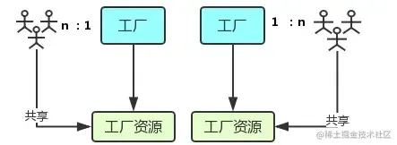

## 一、线程与进程
### 1.概念
我们经常说JS 是单线程执行的，指的是一个进程里只有一个主线程，那到底什么是线程？什么是进程？
官方的说法是：**进程是 CPU资源分配的最小单位；线程是 CPU调度的最小单位**。这两句话并不好理解，我们先来看张图： 


- 进程好比图中的工厂，有单独的专属自己的工厂资源。
- 线程好比图中的工人，多个工人在一个工厂中协作工作，工厂与工人是 1:n的关系。也就是说**一个进程由一个或多个线程组成，线程是一个进程中代码的不同执行路线**；
- 工厂的空间是工人们共享的，这象征**一个进程的内存空间是共享的，每个线程都可用这些共享内存**。
- 多个工厂之间独立存在。
### 2.多进程与多线程

- 多进程：在同一个时间里，同一个计算机系统中如果允许两个或两个以上的进程处于运行状态。多进程带来的好处是明显的，比如你可以听歌的同时，打开编辑器敲代码，编辑器和听歌软件的进程之间丝毫不会相互干扰。
- 多线程：程序中包含多个执行流，即在一个程序中可以同时运行多个不同的线程来执行不同的任务，也就是说允许单个程序创建多个并行执行的线程来完成各自的任务。

以Chrome浏览器中为例，当你打开一个 Tab 页时，其实就是创建了一个进程，一个进程中可以有多个线程（下文会详细介绍），比如渲染线程、JS 引擎线程、HTTP 请求线程等等。当你发起一个请求时，其实就是创建了一个线程，当请求结束后，该线程可能就会被销毁。
## 二、浏览器内核
简单来说浏览器内核是通过取得页面内容、整理信息（应用CSS）、计算和组合最终输出可视化的图像结果，通常也被称为渲染引擎。
浏览器内核是多线程，在内核控制下各线程相互配合以保持同步，一个浏览器通常由以下常驻线程组成：

- GUI 渲染线程
- JavaScript引擎线程
- 定时触发器线程
- 事件触发线程
- 异步http请求线程
### 1.GUI渲染线程

- 主要负责页面的渲染，解析HTML、CSS，构建DOM树，布局和绘制等。
- 当界面需要重绘或者由于某种操作引发回流时，将执行该线程。
- 该线程与JS引擎线程互斥，当执行JS引擎线程时，GUI渲染会被挂起，当任务队列空闲时，主线程才会去执行GUI渲染。
### 2.JS引擎线程

- 该线程当然是主要负责处理 JavaScript脚本，执行代码。
- 也是主要负责执行准备好待执行的事件，即定时器计数结束，或者异步请求成功并正确返回时，将依次进入任务队列，等待 JS引擎线程的执行。
- 当然，该线程与 GUI渲染线程互斥，当 JS引擎线程执行 JavaScript脚本时间过长，将导致页面渲染的阻塞。
### 3.定时器触发线程

- 负责执行异步定时器一类的函数的线程，如： setTimeout，setInterval。
- 主线程依次执行代码时，遇到定时器，会将定时器交给该线程处理，当计数完毕后，事件触发线程会将计数完毕后的事件加入到任务队列的尾部，等待JS引擎线程执行。
### 4.事件触发线程

- 主要负责将准备好的事件交给 JS引擎线程执行。

比如 setTimeout定时器计数结束， ajax等异步请求成功并触发回调函数，或者用户触发点击事件时，该线程会将整装待发的事件依次加入到任务队列的队尾，等待 JS引擎线程的执行。
### 5.异步http请求线程

- 负责执行异步请求一类的函数的线程，如： Promise，axios，ajax等。
- 主线程依次执行代码时，遇到异步请求，会将函数交给该线程处理，当监听到状态码变更，如果有回调函数，事件触发线程会将回调函数加入到任务队列的尾部，等待JS引擎线程执行。
## 三、浏览器中的 Event Loop
### 1. Macro-Task（宏任务） 与 Micro-Task（微任务）
浏览器端事件循环中的异步队列有两种：macro（宏任务）队列和 micro（微任务）队列。

- 常见的 macro-task 比如：setTimeout、setInterval、script（整体代码）等。 
- 常见的 micro-task 比如: new Promise().then(回调)等。
### 2.Event Loop 过程解析


- 一开始执行栈空, **微任务**队列空，**宏任务**队列里有且只有一个 script 脚本（整体代码）。
- 全局上下文（script 标签）被推入执行栈执行。在执行的过程中，会判断是同步任务还是异步任务，通过对一些接口的调用，可以产生新的**宏任务**与**微任务**，它们会分别被推入各自的任务队列里。同步代码执行完了，script 脚本会被移出 执行栈，这个过程本质上是队列中 **宏任务** 执行和出队的过程。
- 上一步我们出队的是一个 **宏任务**，这一步我们处理的是 **微任务**。但需要注意的是：当  **宏任务**出队时，任务是**一个一个**执行的；而 **微任务** 出队时，任务是**一队一队**执行的。因此，我们处理 **微任务** 队列这一步，会逐个执行队列中的任务并把它出队，直到队列被清空。
- **执行渲染操作，更新界面**
- 上述过程循环往复，直到两个队列都清空
### 总结：
**当某个宏任务执行完后,会查看是否有微任务队列。如果有，先执行微任务队列中的所有任务，如果没有，会读取宏任务队列中排在最前的任务，执行宏任务的过程中，遇到微任务，依次加入微任务队列。栈空后，再次读取微任务队列里的任务，依次类推。**
## 四、练习题
### 案例1:微任务和GUI渲染
```javascript
// 问1：background渲染了几次？
// 问2：console.log输出顺序是什么？
document.body.style.background = 'red'
console.log(1)
Promise.resolve().then(() => {
  console.log(2)
  document.body.style.background = 'yellow'
})
// setTimeout(() => {
//   document.body.style.background = 'blue'
// }, 0);
console.log(3)

```
### 案例2:事件任务
```javascript
// 问1：代码执行输出了什么？
// 问2：点击test按钮输出了什么？
const button = document.createElement('button')
button.addEventListener('click', () => {
  Promise.resolve().then(() => console.log('micro 1'))
  console.log('event 1');
})
button.addEventListener('click', () => {
  Promise.resolve().then(() => console.log('micro 2'))
  console.log('event 2');
})
button.innerText = 'test'
document.body.appendChild(button)
button.click()
```
### 案例3:setTinmeOut
```javascript
// 问：输出了什么？
setTimeout(() => {
  console.log('1')
}, 20);
console.log('2')
setTimeout(() => {
  console.log('3')
}, 60);
console.time('a')
for (let index = 0; index < 99999999; index++) { // 该循环执行大概85ms左右
}
console.timeEnd('a')
console.log('4')
setTimeout(() => {
  console.log('5')
}, 5);
console.log('6')
setTimeout(() => {
  console.log('7')
}, 15);
console.log('8')
// 2 4 6 8 1 3 5 7

```
### 案例4:async.await
```javascript
async function async1() {
    console.log("async1 start");
    await  async2();
    console.log("async1 end");
}
async  function async2() {
    console.log( 'async2');
}
console.log("script start");
setTimeout(function () {
    console.log("settimeout");
},0);
async1();
new Promise(function (resolve) {
    console.log("promise1");
    resolve();
}).then(function () {
    console.log("promise2");
});
console.log('script end'); 

// script start => async1start => async2 => p1 => script end => aend => p2 =>out
```
### 案例5:终极promise案例
```javascript
Promise.resolve()
  .then(() => {
    console.log(0)
    return Promise.resolve(4)
    // task x.then
  })
  .then(res => {
    console.log(res)
  })
Promise.resolve()
  .then(() => {
    console.log(1)
  })
  .then(() => {
    console.log(2)
  })
  .then(() => {
    console.log(3)
  })
  .then(() => {
    console.log(5)
  })
  .then(() => {
    console.log(6)
  })
// 0 1 4 2 3 5 6
```
## 参考链接：
[Event Loop在HTML5中的实现规范](https://html.spec.whatwg.org/multipage/webappapis.html#event-loops)
[浏览器与Node的事件循环(Event Loop)有何区别?](https://juejin.cn/post/6844903761949753352)
[【V8源码补充篇】从一道让我失眠的 Promise 面试题开始，深入分析 Promise 实现细节](https://juejin.cn/post/6953452438300917790)
[promise.then 中 return Promise.resolve 后，发生了什么？](https://www.zhihu.com/question/453677175)
